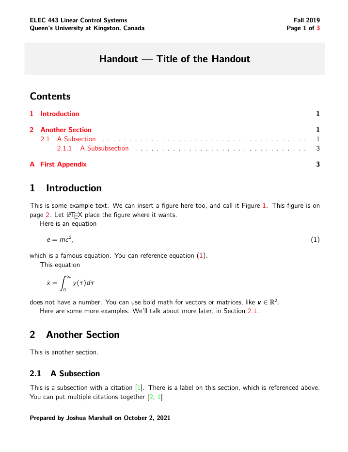

# Course Handout LaTeX Class and Template

This is a LaTeX template for making simple handouts for courses or other technical purposes.

## Sample Output

## Contact the Author

Send any suggested edits or comments to the author by using the coordinates below.

> [Joshua Marshall](https://www.ece.queensu.ca/people/j-marshall), PhD, PEng  
> [Department of Electrical and Computer Engineering](https://www.ece.queensu.ca)  
> [Queen's University](http://www.queensu.ca)  
> Kingston, ON K7L 3N6 Canada  
> +1 (613) 533-2921  
> [joshua.marshall@queensu.ca](mailto:joshua.marshall@queensu.ca)
